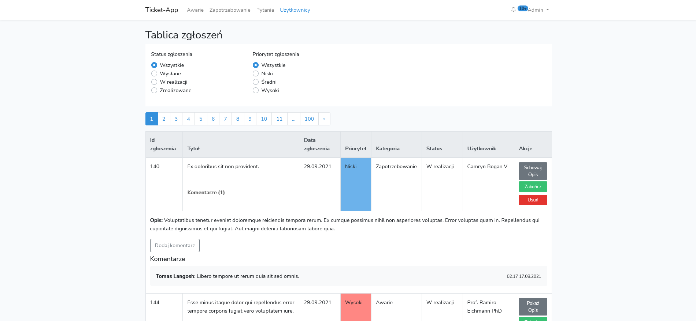

# TicketApp

A simple application to receive tickets for the help desk and administration sections.



## Table of Content

- [TicketApp](#ticketapp)
  - [Table of Content](#table-of-content)
  - [General info](#general-info)
  - [Technologies](#technologies)
  - [Setup](#setup)
  - [Features](#features)
  - [TODO](#todo)
  - [License](#license)

## General info

This application is a tool mainly for help desk and administration sections in variety companies. It allows to easily manage malfunctions and track progress of the reports.

## Technologies

Application is created with following technologies:

**Backend**:

- [PHP 7.x](https://www.php.net/downloads.php) / [Laravel 8.x](https://laravel.com/docs/8.x/installation)
- [Sanctum](https://laravel.com/docs/8.x/sanctum)
- [Laravel Permission](https://spatie.be/docs/laravel-permission/v5/introduction)
- MySQL database

**Frontend**:

- [npm](https://www.npmjs.com/)
- [Vue 2.6](https://vuejs.org/v2/guide/installation.html)
- [Laravel UI Auth 3.x](https://github.com/laravel/ui)
- [Bootstrap 4.6](https://getbootstrap.com/docs/4.6/getting-started/introduction/)
- [BootstrapVue 2.x](https://bootstrap-vue.org/)

## Setup

If you want to run this project, you must have:

- **Apache** / **Nginx** web server
- **MySQL** / **PostgreSQL** database server
- **PHP** at least version 7
- **Laravel** version 8
- **composer** package manager
- **npm** package manager

```bash
# Clone this repository to the server
$ git clone https://github.com/jwedrowycz/ticket-app

# Go into the repository
$ cd ticket-app

# Install dependencies
$ composer install
$ npm install 

# Copy and configure your .env file
$ cp .env.example .env

# Run migrations with fake seed data.
$ php artisan migrate --seed

# Generate application encryption key
$ php artisan key:generate
```
Default admin login:password is *admin@example.com:qweqweqwe*

## Features

- Login system with registration of new users
- Send tickets
- Receive tickets
- Tickets have:
  - three priorities: *low*, *medium* and *high*
  - three statuses: *sent*, *realized*, *completed*
  - attachements *(jpg, png, jpeg)*
  - categories: *malfunctions*, *orders* and *questions*
  - ticket comments
- Notifications about states of tickets and new tickets
- Ticket's status and priority filters
- Adding users
- Users have to change password on first login

## TODO

- [ ] Mark notifications as read (generally working, but some fixes must be done)
- [x] Ticket categories
- [x] Ticket comments
- [x] Priority filter
- [x] Attachements for tickets
- [ ] Users edition
- [ ] Reset users password
## License

MIT

